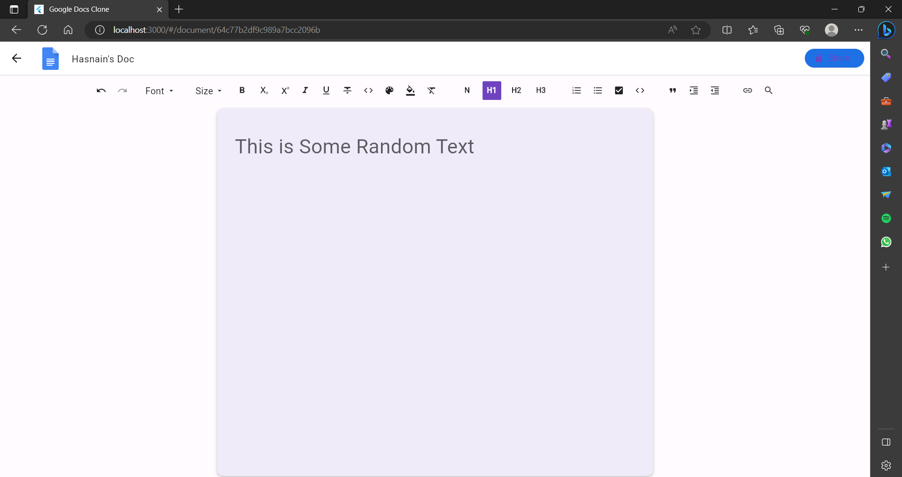

# Google Docs Clone

This is a Google Docs clone project built using Flutter, MongoDB, Express, and Riverpod. It aims to replicate the basic functionality of Google Docs, allowing users to collaboratively edit and create documents in real-time.

## Features

- **Real-time Collaboration:** Multiple users can work on the same document simultaneously, and changes made by one user are instantly reflected to others.
- **Document Management:** Users can create, edit, and delete documents. Each document has its own unique URL for easy sharing.
- **Rich Text Editing:** The editor supports basic formatting options like bold, italic, underline, bullet points, etc.
- **User Authentication:** Users can sign up, log in, and log out. Authenticated users have access to their own documents.

## Tech Stack

- **Frontend:** Flutter is used for the client-side development, providing a smooth and responsive user interface.
- **Backend:** The server-side is built with Node.js and Express, handling requests and managing the MongoDB database.
- **Database:** MongoDB is used to store documents, user information, and collaboration data.
- **State Management:** Riverpod is employed for state management in the Flutter application, ensuring efficient and organized data flow.

## Installation

Follow these steps to set up the project on your local machine:

1. Clone the repository:

```
git clone https://github.com/hasnainmakada-99/google-docs-clone.git

cd google-docs-clone
```


2. Install dependencies:

```
flutter pub get // First run this

cd server // Navigate to server

npm install // Then run this
```
3. Start the backend server

```
npm run dev
```
4. Run the Flutter App

```
flutter run -d <your-preffered-browser-name-here> --web-port=3000
```
# Screenshots

<table>
<tr>
<td></td>
<td></td>
<td></td>
</tr>
</table>

# Usage
- Once the Flutter app is running, you can log in with your existing google sign in credentials.
- After logging in, you will be taken to the dashboard where you can create a new document or access your existing ones.
- When you create a new document, a unique URL will be generated for it, which you can share with others to collaborate in real-time.
- The editor provides basic formatting options like bold, italic, underline, and bullet points. Changes made by one user will be automatically updated for others.
